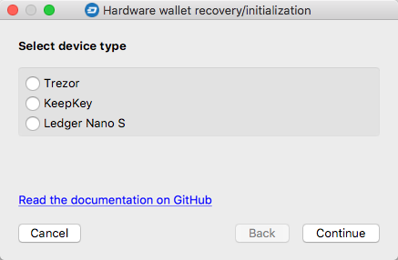
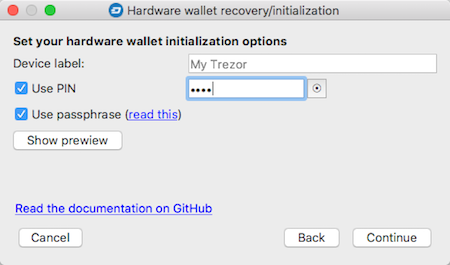
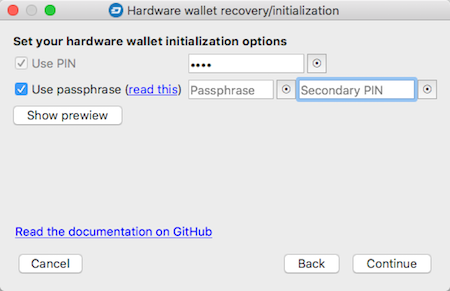
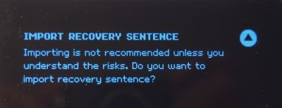

# Hardware wallet recovery - convenient mode

This procedure differs from safe mode in that the words composing the recovery seed are entered in a special editor, all visible at the same time. While this method is more convenient than entering each word separately in a random order, it also has some important consequences impacting the security of the procedure.

> **Remark concerning Ledger Nano S wallet**  
> Before launching this function, you should put the device in Recovery mode, as described on the first screen of the wizard.

> **Remarks on security**  
> During one of the steps in this scenario, all words of the recovery seed will at some point be simultaneously visible on the computer screen. This means it is critical to follow this scenario only on an offline computer, unless for testing purposes. By "offline" we mean a system that is not and will never be connected to a network.
>
> For the purposes of this scenario, it is also best to use a system launched from a live CD (as described [here](hw-initr-live-cd-linux.md)), that ceases to exist as a system once it has been turned off. This ensures that there is no trace of confidential information stored anywhere.

#### Step 1: Select the type of hardware wallet in use in the first step of the wizard

#### Step 2: Select the `Recover hardware wallet from seed words – convenient` option  

#### Step 3: Select the number of words in your recovery seed   

#### Step 4: Enter all recovery seed words in the corresponding fields  

#### Step 5: Define hardware wallet configuration options  
Note: for Ledger Nano S devices, this window is slightly more complex than in case of Trezor and KeepKey.

**Options for Trezor and KeepKey devices**  
  
- Use PIN: if checked, the PIN entered by the user in the field will be set on the device
- Use passphrase: if checked, the passphrase option will be enabled

**Options for Ledger Nano S devices**  
  
-  Use PIN: see above
-  Use passphrase: check this option if you are using a passphrase (BIP39) and you want to save it in the device memory. This may not seem like the best idea, but for this device, the only alternative is to enter the passphrase whenever needed using the two physical buttons. This is annoying for short character strings, and can be a nightmare for long ones. Nevertheless, this option was has been designed reasonably well by the manufacturer, providing as much security as possible in such situations. The passphrase is only activated if the user enters the Secondary PIN when connecting the device – otherwise, the basic set of keys is activated instead.

**Preview addresses**  
In this step of the wizard, it is possible to preview the Polis addresses that will be available in the device once initialization based on the entered recovery seed is complete. This option can be useful for verification purposes or to people who have previously initialized their device but now have doubts about whether the recovery seed saved at the time was correct. It can easily be checked here by verifying if the addresses shown in the preview match those presented by the device for a given BIP32 path. Click the `Show preview` button to preview the addresses.

 

There is also an option to change the BIP32 path to something other than the default, as well as verify the influence of passphrase on the addresses generated.

#### Step 6: Accept the security prompt 
In this step, Trezor and KeepKey devices (quite reasonably) display a warning, informing the user that it might not be safe to import the entire recovery seed from the computer to the device at once. As mentioned before, if at any point a complete recovery seed is found on a working OS, and the computer is (or will be) connected to the Internet, there is a risk that the data could be intercepted by unauthorized parties, which could potentially result in financial loss.

  

If the operation is performed on an offline system, we can safely click the button to confirm our awareness of this fact. This is followed by the following message, completing the procedure:  

